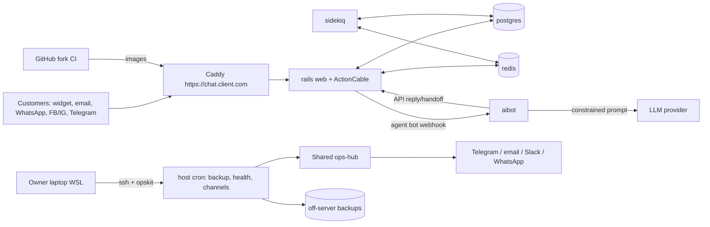

# Technical Architecture — Inbox Ops Kit (Chatwoot fork)

> Derived from `docs/SPEC.md`. SPEC wins on conflicts. Upstream internals: pinned code + official docs (verify).

## 1. System context


## 2. Repo structure (ours)
```
opskit/
  bin/opskit, bin/check
  lib/*.sh                  logging, confirm, validate, render, ssh, docker, chatwoot_api
  schema/                   client.schema.json, bot.schema.json, pack.schema.json
  templates/                compose.yml.tmpl, env.tmpl, caddy.tmpl, cron.tmpl, client.yaml.tmpl, report/, alerts/
  agent/                    backup.sh, health.sh, channels.sh, heartbeat.sh (standalone on hosts)
  packs/<industry>/         canned_responses, labels, automations, business_hours, auto_replies, kb_starter (bn + en)
  hub/                      ops-hub additions (flows/monitors for Chatwoot clients)
  tests/                    bats + fixtures
  clients/, hosts/          git-ignored registries
aibot/
  pyproject.toml, Dockerfile
  src/aibot/{app.py, config.py, chatwoot.py, kb.py, retrieval.py, lang.py, llm.py, policy.py, handoff.py, audit.py, eval.py, metrics.py}
  tests/
.github/workflows/opskit-ci.yml, opskit-image.yml
docs/ (ours), explore/ (git-ignored)
```
Dependency direction: `opskit/bin → lib → templates/schema`; `aibot.app → policy → (retrieval, llm, handoff) → chatwoot client`; pure logic (`lang`, `retrieval`, `policy`) has no network I/O.

## 3. Client stack
Services: `rails`, `sidekiq`, `postgres`, `redis`, `aibot`; volumes `<id>_postgres`, `<id>_redis`, `<id>_storage`, `<id>_aibot`; only Caddy exposes 80/443; `aibot` reachable only on the internal network.

## 4. aibot request flow
webhook (secret path) → validate event type/account/inbox → ignore non-customer messages & bot's own → language detect → human-request/complaint check → retrieve top-k → LLM JSON → policy gate (confidence, snippet use, price/policy claims only from KB) → reply via API or handoff (message + status open + label + team) → audit row (no logs of text).

## 5. Key ops flows
Deploy, backup, restore, upgrade: same pattern as the Activepieces kit (render → deploy → verify; dump → encrypt → remote → heartbeat; fresh-stack restore; staging → promote → rollback), plus `db:chatwoot_prepare` on deploy/upgrade and storage volume in backups.

## 6. Sizing defaults (Phase 0 overrides)
rails 1.5 GB, sidekiq 1 GB (concurrency 5), postgres 1 GB, redis 256 MB, aibot 256 MB; 4 GB host + 2 GB swap minimum.

## 7. Extension points kept open for V2 add-ons (ADR-014)
Nothing below adds features now; each is a design constraint for the phase named, so the V2 add-ons plug in without rework.
| Needed by (V2 add-on) | Constraint on V1 work | Phase |
|---|---|---|
| all | `client.yaml` has reserved `addons.<id>.{enabled,settings}` (enabled must be false, rejected with "V2") and `brand` (default Chatwoot). Done in Phase 1 | 1 |
| all bot add-ons | aibot webhook handler dispatches an event to an ordered list of handlers (`handlers/` package; V1 = the answer handler only), so a new handler does not edit `app.py` | 8 |
| order capture/status, booking | `chatwoot.py` exposes: send message, private note (`private: true`), set labels, set conversation custom attributes, toggle status, assign team. All behind one client class | 8 |
| order capture/status, booking | an outbound "connector" interface (`connectors/`, V1 empty) for Google Sheets/Calendar/shop APIs; credentials only via env names in `addons.<id>.settings` | 8 |
| auto-labels, agent assist | LLM adapter returns structured JSON for any prompt (not only the answer prompt); prompts live in `aibot/prompts/` | 8 |
| FAQ editor | KB is plain files in `kb/` with a stable format; aibot can reload the KB without restart (`POST /admin/reload`, internal network only) | 8 |
| agent assist, digest | audit/metrics store is SQLite with a schema-version table so V2 can add tables | 8 |
| owner digest, alerts | opskit has one `lib/notify.sh` Telegram sender (used by Phase 4 fallback and reusable by the digest) | 4 |
| owner digest, reports | care-report data collection is separate from rendering (collector -> JSON -> HTML), so a daily digest reuses the collector | 9 |
| after-hours, CSAT | packs may include CSAT settings and business-hours auto replies (data only; Chatwoot built-ins) | 7 |
| booking, FAQ editor | compose template can add optional services (profiles) without changing the base stack | 2 |
